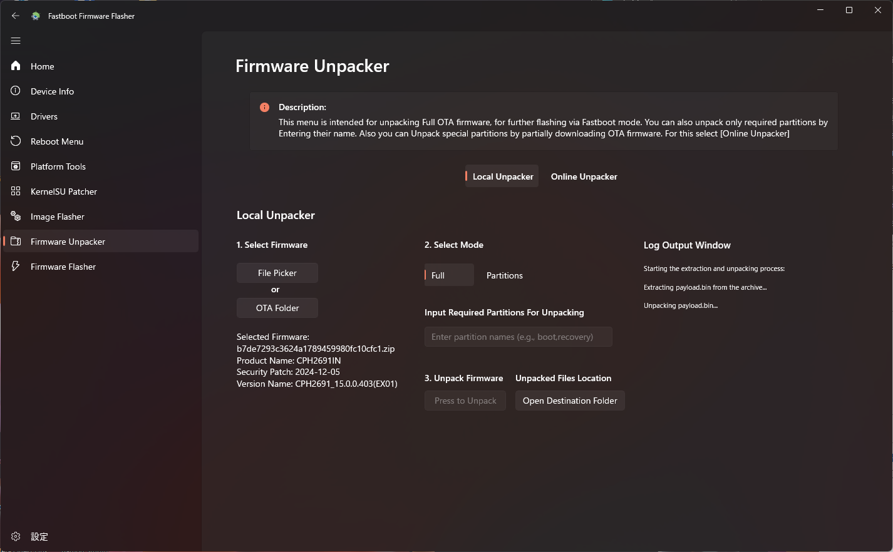
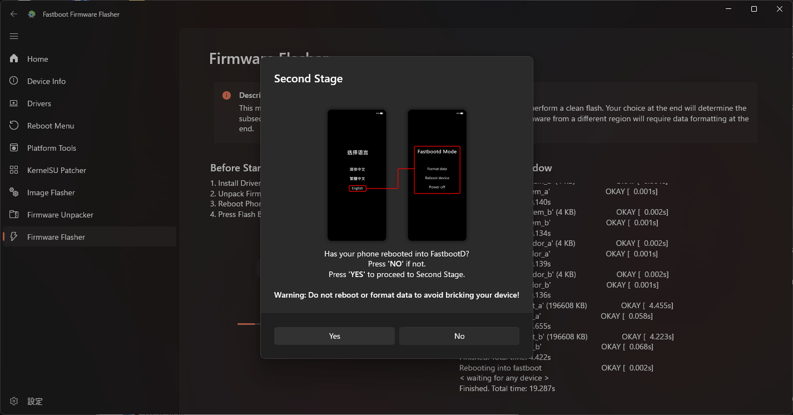
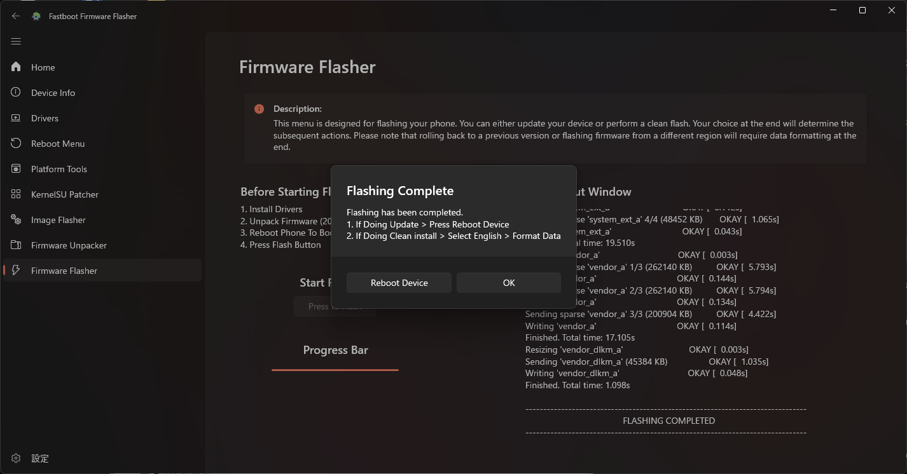

**English** | [日本語](convert_guide_jp.md) | [简体中文](convert_guide_zh.md)

# Converting OnePlus Ace 5 to OnePlus 13R
- Tested environment: ColorOS_PKG110_15.0.0.405 to OxygenOS_CPH2691_15.0.0.403
- Camera will not work with only flashing OxygenOS firmware, ```odm.img``` from original ColorOS is required for complete camera compatibility.

## Conversion Report
- If you have converted your device, please share your experience with us.
    [Convert Report Template](https://github.com/kinginu/Oneplus-Ace5-to-13R/issues/new?template=convert_report_template.md)

## Bootloader Unlock
- Unlocking the bootloader will factory reset your device.
1. enable developer options
2. enable usb debugging and oem unlocking in developer options
3. connect your device to your pc
4. boot into fastboot mode
    ```shell
    adb reboot bootloader
    ```
5. unlock the bootloader
    ```shell
    fastboot flashing unlock
    ```
6. reboot your device
    ```shell
    fastboot reboot
    ```

## Obtaining OxygenOS Firmware
- Complete OTA package of OxygenOS is required for the conversion.
1. Install [Oxygen Updater](https://play.google.com/store/apps/details?id=com.arjanvlek.oxygenupdater) from Play Store.
2. Select OnePlus 13R(IN) as the device.
3. Enable Advanced Mode in the settings.
4. Select Stable (full) as Update Method. 
5. Download the full OTA package.

## Obtaining ColorOS ```odm.img``` (optional, but recommended)
- ```odm.img``` from original ColorOS is required for complete compatibility of the camera.
- For rooted user, now you can install Ace 5 Drivers module instead of flashing odm.img.
Two option are available to obtain the firmware:
    Option 1. Download the firmware (Easy)
    Option 2. Extract the firmware using DSU Sideloader (Hard)

### Option 1. Downloading the Firmware
- [Unofficial ROM Site](https://yun.daxiaamu.com/OnePlus_Roms/%E4%B8%80%E5%8A%A0OnePlus%20ACE%205/)
1. Download the firmware using the following link　(downloading from brower will not work, use curl or wget instead).

    https://gauss-compotacostauto-cn.allawnfs.com/remove-7955272e42856dfa19471f0a3a6d7885/component-ota/25/01/08/781337963e6c450ab363895ef9bcfa60.zip

    - Aria2app is recommended for downloading.

        https://t.me/gt3neo5hub/521/229188

        - set following global options in Aria2app
            - ```max-connection-per-server=16```
            - ```split=16```

        - Select ```Add URL``` from the plus icon in the bottom right corner, then paste the link and start downloading.

    - Or use the following command in terminal. (aria2 is required)
        ```shell
        aria2c -x 16 -s 16 --continue=true --max-tries=10 --retry-wait=5  https://gauss-compotacostauto-cn.allawnfs.com/remove-7955272e42856dfa19471f0a3a6d7885/component-ota/25/01/08/781337963e6c450ab363895ef9bcfa60.zip
        ```

2. Unpack the downloaded firmware using Fastboot Firmware Flasher
    

3. Select "Full" and press to unpack.
    

4. Open destination folder and copy the ```odm.img``` file.
    - ```odm.img``` is located at ```FastbootFirmwareFlasher/FIRMWARE/SYSTEM/odm.img```


### Option 2. Extracting the Firmware
- [DSU Sideloader](https://github.com/VegaBobo/DSU-Sideloader)
- Boot into DSU mode with rooted GSI image, then copy the firmware of the device.

## Flashing OxygenOS Firmware
- Fastboot Firmware Flasher is required for flashing process.
1. Select Firmware Unpacker, select OxgenOS OTA firmware to unpack.
    

2. Select "Full" and press to unpack.
    

3. Connect your device to PC and boot into fastboot mode.
    ```shell
    adb reboot bootloader
    ```

4. Select Firmware Flasher and start flashing.
    

5. After first stage finished, device will automatically reboot into fastbootD mode.
    

6. Start second stage after your device is ready.
    

7. After the second stage finished, select "English" in the device and Format data.
    

8. Your device is now converted to OnePlus 13R.
    
    - The OS version is displayed as "OxgenOS 15.0", but the Battery and Camera configration is OnePlus Ace5.


## Flashing ColorOS ```odm.img```
- This step is optional, but recommended for complete compatibility of the camera.
- For rooted user, now you can install Ace 5 Drivers module instead of flashing odm.img.
1. Enable USB debugging and connect your device to PC.

2. Boot into fastbootD mode.
    ```shell
    adb reboot fastboot
    ```

3. Flash the ColorOS ```odm.img```.
    ```shell
    fastboot flash odm odm.img
    ```

4. Reboot your device.
    ```shell
    fastboot reboot
    ```

5. Your device is now fully compatible with the camera.

## Installing driver module
- If you have rooted your device, you can use Magisk or KernelSU to install [Ace 5 Drivers](https://github.com/Devone127/Ace-5-Drivers) from [@Devone127](https://github.com/Devone127) to complete the camera functions without having to install ColorOS's odm.img

## For "complete" Conversion (optional)
- Since```my_company.img```and```my_preload.img```are not included in the OTA package, the conversion is not "complete".
- Those files are required for pre-installed apps, but they are not necessary for the device to function.
- **Note:** The tool adds empty ```my_preload.img``` and ```my_company.img``` files which do not contain any regional apps.
- If you have those files, you can flash them using the same method as```odm.img```.
    ```shell
    adb reboot fastboot
    ```
    ```shell
    fastboot flash my_company my_company.img
    fastboot flash my_preload my_preload.img
    ```