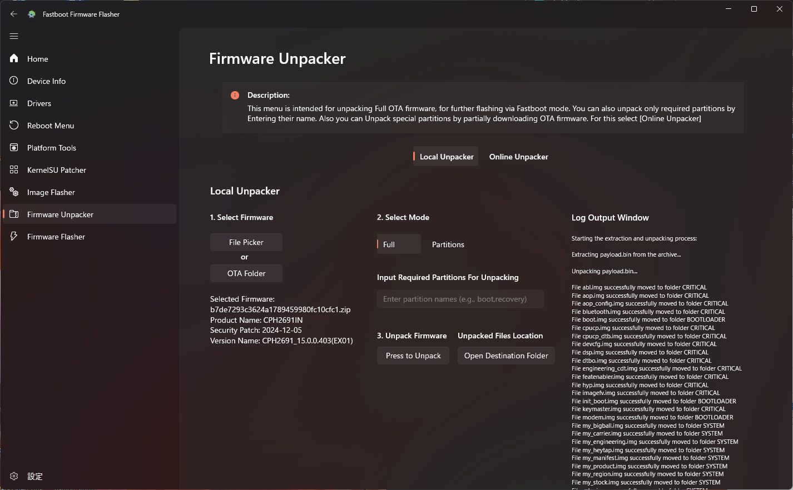

[English](convert_guide_en.md) | [日本語](convert_guide_jp.md) | **简体中文**

# 将 OnePlus Ace 5 转换至 OnePlus 13R
- 测试环境: ColorOS_PKG110_15.0.0.405 to OxygenOS_CPH2691_15.0.0.403
- 若只刷入OxygenOS固件，相机将无法使用, 来自原ColorOS的```odm.img```对于完整的相机功能是必要的。

## 转换报告
- 如果你成功转换了你的设备, 请与我们分享你的经验。
    [Convert Report Template](https://github.com/kinginu/Oneplus-Ace5-to-13R/issues/new?template=convert_report_template.md)

## 解锁 Bootloader
- 解锁 Bootloader 将会恢复出厂设置
1. 启用开发者选项
2. 在 开发者选项 中打开 USB调试 和 OEM解锁
3. 将你的设备连接电脑
4. 将设备重启进入 fastboot 模式
    ```shell
    adb reboot bootloader
    ```
5. 解锁 Bootloader
    ```shell
    fastboot flashing unlock
    ```
6. 重启你的设备
    ```shell
    fastboot reboot
    ```

## 获取 OxygenOS 固件
- 完整的 OTA更新包 对于转换到 OxygenOS 是必要的。
1. 从 Play 商店 下载 OxgenUpdater（中国大陆网络环境可能无法访问，请自行解决该问题）
2. 选择 OnePlus 13R(IN) 作为设备
3. 在设置中启用 高级模式
4. 选择 Stable (full) 作为 更新方式
5. 下载完整的 OTA 更新包

## 获取 ColorOS ```odm.img``` (可选, 但建议进行)
- 来自原ColorOS的```odm.img```对于完整的相机功能是必要的。
以下两个选项都可以获得固件:
    选项 1. 下载固件 (较容易)
    选项 2. 使用 DSU侧载 提取固件 (较难)

### 选项 1. 下载固件
- [Unofficial ROM Site](https://yun.daxiaamu.com/OnePlus_Roms/%E4%B8%80%E5%8A%A0OnePlus%20ACE%205/)
1. 使用以下链接下载固件　(使用浏览器下载可能无法使用, 使用wget或curl代替).

    https://gauss-compotacostauto-cn.allawnfs.com/remove-7955272e42856dfa19471f0a3a6d7885/component-ota/25/01/08/781337963e6c450ab363895ef9bcfa60.zip

    - 推荐使用 Aria2app 进行下载

        https://t.me/gt3neo5hub/521/229188

        - 在 Aria2app 中设置以下全局设置
            - ```max-connection-per-server=16```
            - ```split=16```

        - 选择 ```Add URL``` from the plus icon in the bottom right corner, 接着粘贴链接并开始下载

    - 或者终端中使用以下命令 (需要aria2)
        ```shell
        aria2c -x 16 -s 16 --continue=true --max-tries=10 --retry-wait=5  https://gauss-compotacostauto-cn.allawnfs.com/remove-7955272e42856dfa19471f0a3a6d7885/component-ota/25/01/08/781337963e6c450ab363895ef9bcfa60.zip
        ```

2. 使用 Fastboot Firmware Flasher 对已下载的固件进行解包
    

3. 选择 "Full" 并按下"Press to unpack"
    

4. 打开目标文件夹并复制对应的 ```odm.img``` 文件
    - ```odm.img``` 存放在 ```FastbootFirmwareFlasher/FIRMWARE/SYSTEM/odm.img```


### 选项 2. 解包固件
- [DSU Sideloader](https://github.com/VegaBobo/DSU-Sideloader)
- 使用带root的 GSI镜像 引导进入DSU 模式, 接着提取出设备的固件

## 刷入 OxygenOS 固件
- Fastboot Firmware Flasher 对于刷入过程是必要的。
1. 选择 Firmware Unpacker, 选择你的 OxgenOS OTA 固件 进行解包
    

2. 选择 "Full" 并点击 "press to unpack".
    

3. 将你的设备连接至电脑并引导进入 fastboot 模式
    ```shell
    adb reboot bootloader
    ```

4. 选择 Firmware Flasher 并开始刷入
    

5. 在第一步(First Stage)操作完成之后, 设备将会自动重启进入 fastbootD 模式
    

6. 在你的设备准备就绪后开始第二步(second stage)
    

7. 在第二步(second stage)完成之后, 在设备中选择 "English" 并格式化数据(Format data)
    

8. 现在你的设备已经转换到了 OnePlus 13R
    
    - 系统版本已经显示为 "OxgenOS 15.0", 但是电池和相机配置均为OnePlus Ace 5


## 刷入 ColorOS 的 ```odm.img```
- 这一步是可选的, 但是为了完整的相机功能, 建议进行本步操作
1. 启用开发者选项并将你的设备连接到电脑

2. 引导进入 fastbootD 模式
    ```shell
    adb reboot fastboot
    ```

3. 刷入 ColorOS 的 ```odm.img```.
    ```shell
    fastboot flash odm odm.img
    ```

4. 重启你的设备
    ```shell
    fastboot reboot
    ```

5. 现在你的设备拥有了完整的相机功能


## 对于完全地转换 (optional)
- 自从```my_company.img```以及```my_prelaod.img```都不再包含在 OTA 更新包内, 转换过程不再是完全地转换
- 这些文件对于预装app都是必要的, 但对于设备的功能不是必需的
- **注:** 这个工具添加了空的 ```my_preload.img``` 和 ```my_company.img``` ,这些都不具有相关区域的app
- 如果你有这些文件, 你可以使用和刷入```odm.img```一样的方法刷入它
    ```shell
    adb reboot fastboot
    ```
    ```shell
    fastboot flash my_company my_company.img
    fastboot flash my_prelaod my_prelaod.img
    ```