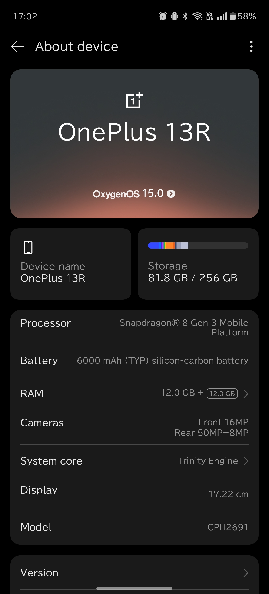
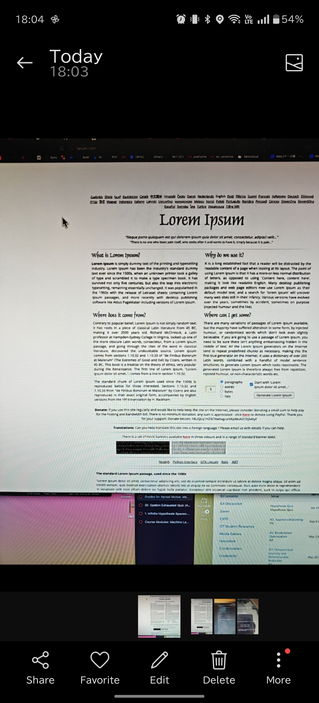
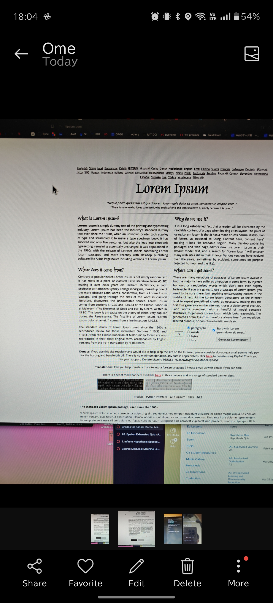
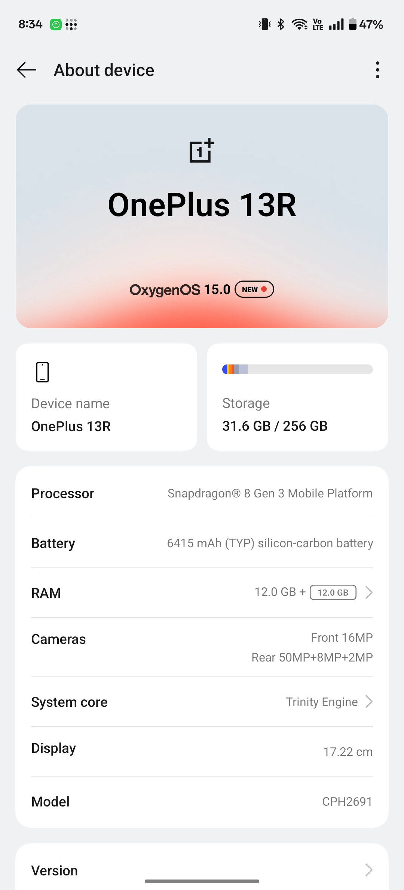

# Functionality Difference with odm.img Files

## OxygenOS odm.img

When using the OxygenOS odm.img, the device information displays:
- **Battery**: 6000mAh
- **Cameras**: Front 16MP, Rear 50MP+8MP

  
View Image

  
  

### Camera App Issues
- In PHOTO mode, only 1x and 2x zoom options are available.
- Taking a photo in PHOTO mode causes the camera app to become unresponsive.
- After the app becomes unresponsive, reopening the app or viewing the taken photo restores functionality.
- Photos taken in this mode are blurry and not viewable from the file manager, though they appear in the photo app.
- Even at 1x zoom, photo quality is poor.

  
View Image

  
  

### PRO Mode
- Offers 0.6x, 1x, and 2x zoom options.
- The app does not freeze, and photos are clear and properly saved.
- Photos can be accessed from both the photo app and file manager.

  
View Image

  
  

## ColorOS odm.img

Flashing the ColorOS odm.img updates the device information to:
- **Battery**: 6415mAh
- **Cameras**: Front 16MP, Rear 50MP+8MP+2MP

  
View Image

  
  

### Camera App Functionality
- Both PHOTO and PRO modes function correctly.
- All features work as expected, with no freezing or quality issues.

## Relocking the Bootloader

If you choose to relock the bootloader after flashing the ColorOS odm.img, be aware that OTA updates may fail due to the mismatched odm.img. However, if you relock the bootloader without flashing the ColorOS odm.img and consistently use the camera in PRO mode, you might be able to maintain camera functionality without the need for the ColorOS odm.img.

### Benefits of Using PRO Mode
- The 13R firmware can be used as-is, allowing for potential relocking　bootloader and receiving OTA updates post-conversion.
- PRO mode allows full camera functionality without freezing issues.
- The camera app saves the last used mode, so using PRO mode consistently should not be inconvenient.