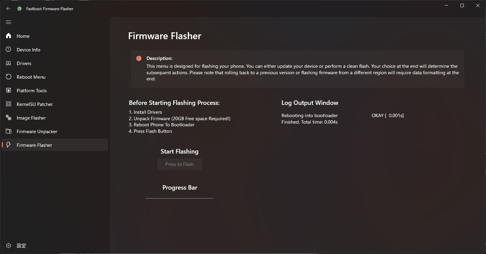
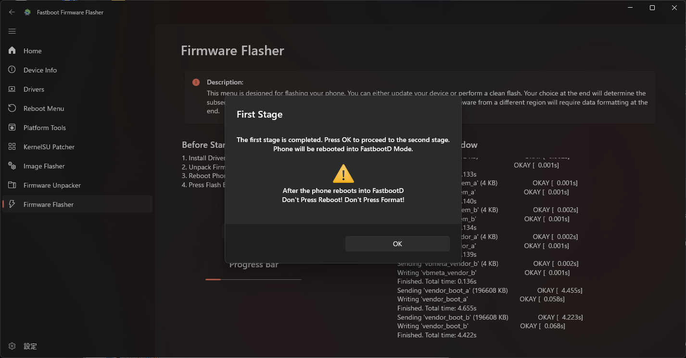
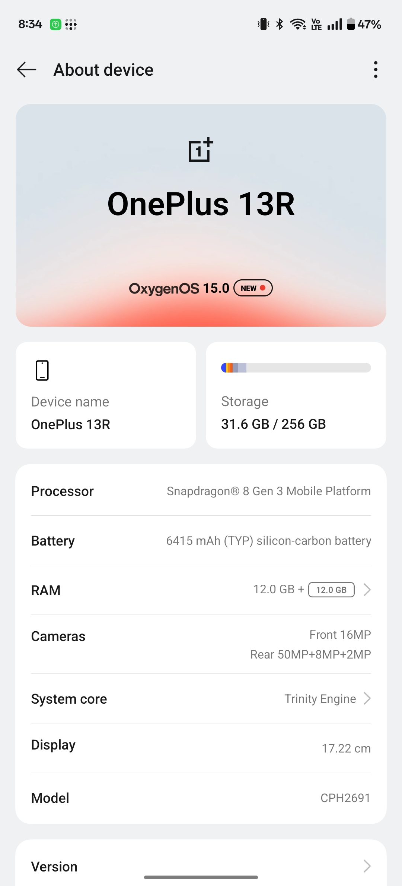

# OnePlus Ace5から13RへのConvert
- 実証環境: ```ColorOS_PKG110_15.0.0.405```から```OxygenOS_CPH2691_15.0.0.403```への変換
- OxygenOSのファームウェアをflashするだけではカメラは正常に動作しません。カメラの完全な互換性のためにはColorOSの```odm.img```のflashが必要です。

## Convertion Report
- Convertの結果を共有してください。[Report Template](https://github.com/kinginu/Oneplus-Ace5-to-13R/issues/new?template=report_template.md）

## Bootloader Unlock
- ブートローダーをアンロックすると、端末が初期化されます。

1. 開発者オプションを有効化
2. 開発者オプションでUSBデバッグとOEMロック解除を有効化
3. 端末をPCに接続
4. fastboot modeに起動
    ```shell
    adb reboot bootloader
    ```
5. ブートローダーをアンロック
    ```shell
    fastboot flashing unlock
    ```
6. 端末の再起動
    ```shell
    fastboot reboot
    ```

## OxygenOSの入手
- Convertに必要なOxygenOSのFull OTAパッケージを入手します。
1.	PlayストアからOxgenUpdaterをインストール
2.	OnePlus 13R (IN) をデバイスとして選択
3.	設定でAdvanced Modeを有効化
4.	Stable (full) をUpdate Methodとして選択
5.	Full OTAパッケージをダウンロード

## ColorOSの```odm.img```の入手（推奨）
- カメラの完全な互換性のために、ColorOSの```odm.img```が必要です。
ファームウェアを取得するための2つのオプションがあります。
    1. ColorOSのFull OTAのダウンロード（簡単）
    2. DSU Sideloaderを使用したファームウェアの抽出（少し大変）

### 1. ファームウェアのダウンロード
- [非公式ROMサイト](https://yun.daxiaamu.com/OnePlus_Roms/%E4%B8%80%E5%8A%A0OnePlus%20ACE%205/)
1. 以下のリンクからダウンロード（ブラウザからはダウンロード不可、curlやwgetを使用）
    https://gauss-compotacostauto-cn.allawnfs.com/remove-7955272e42856dfa19471f0a3a6d7885/component-ota/25/01/08/781337963e6c450ab363895ef9bcfa60.zip
    - Aria2appの使用を推奨
        https://t.me/gt3neo5hub/521/229188

2. Fastboot Firmware Flasherを使用してUnpack
    

3. "Full"を選択してUnpack
    

4. Destination Folderを開き、odm.imgファイルをコピー
    - ```odm.img```は　FastbootFirmwareFlasher/FIRMWARE/SYSTEM/odm.img　にあります。

### 2. ファームウェアの抽出
- [DSU Sideloader](https://github.com/VegaBobo/DSU-Sideloader)
- rootが取れているGSIイメージでDSUモードに起動し、デバイスのファームウェアをコピーします。
- 詳しくはこちらのミ田様の記事を参照してください。
    - [ROM焼き試験場](https://mitanyan98.hatenablog.com/entry/2024/12/07/003717)

## OxygenOSのflash
- FlashにはFastboot Firmware Flasherを使用します。
1. Firmware Unpackerを選択し、OxygenOS OTAファームウェアをUnpack
    

2. "Full"を選択してUnpack
    

3. 端末をPCに接続し、fastboot modeに起動
    ```shell
    adb reboot bootloader
    ```

4. Firmware Flasherを選択し、flashを開始
    

5. First Stageが完了したら、端末が自動でfastbootD modeで再起動
    

6. 端末がfastbootD modeで再起動したら、sedond stageを開始
    

7. Second Stageが完了したら、端末で"English" > "Format data"を選択
    

8. 端末が再起動し、OxygenOSの初期設定が開始
    
    - "OxgenOS 15.0"と表示されていますが、バッテリー情報とカメラ構成はOnePlus Ace5になっています。

## ColorOSの```odm.img```のflash
- カメラの完全な互換性のために、```odm.img```のflashが必要です。
1. USBデバッグを有効化し、端末をPCに接続

2. fastbootD modeに起動
    ```shell
    adb reboot fastboot
    ```

3. ```odm.img```をflash
    ```shell
    fastboot flash odm odm.img
    ```

4. 端末を再起動
    ```shell
    fastboot reboot
    ```

5. 端末が再起動し、カメラが正常に動作することを確認
    

## ”完全な” OxygenOSへのConvert (任意）
- OTAパッケージには```my_company.img```と```my_preload.img```が含まれていないため、Convertは ”完全な”ものではありません。
- これらのファイルはプリインストールアプリに必要ですが、端末の基本的な動作には必須ではありません。
- ファイルがある場合、```odm.img```と同じ方法でflashできます。
    ```shell
    adb reboot fastboot
    ```
    ```shell
    fastboot flash my_company my_company.img
    fastboot flash my_preload my_preload.img
    ```