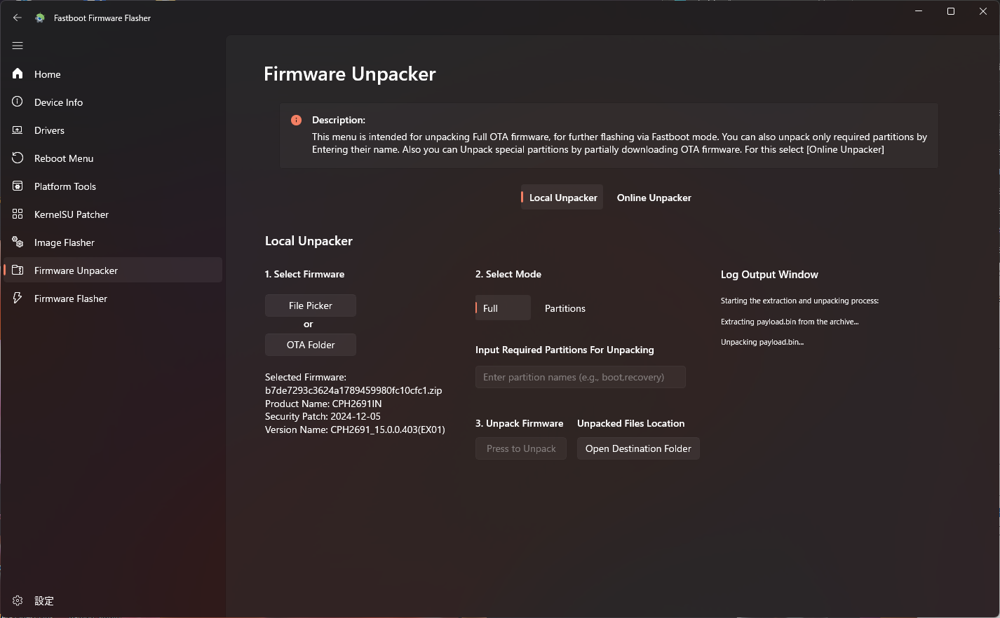
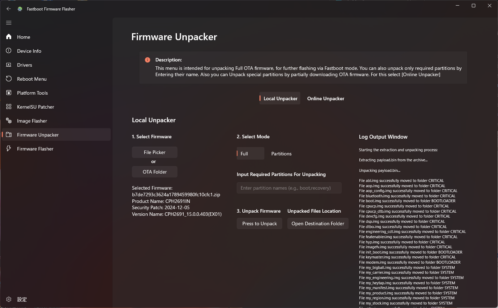
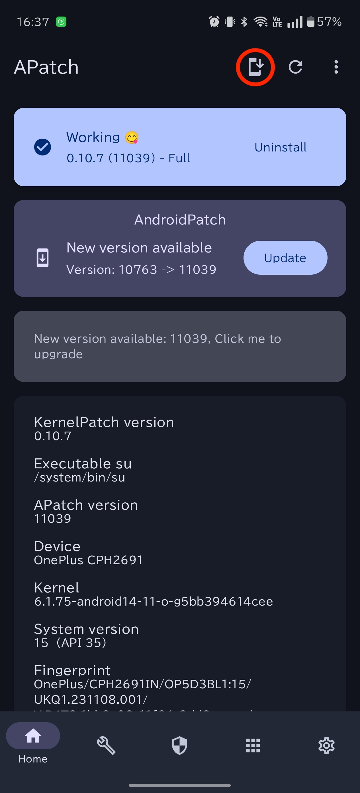
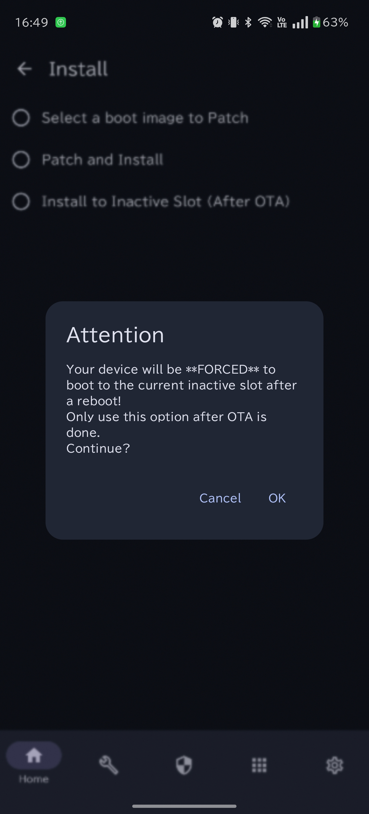

# Update OnePlus 13R firmware
- Tested environment: OxygenOS_CPH2691_15.0.0.403 to OxygenOS_CPH2691_15.0.0.501
- Camera will not work with only updating OxygenOS firmware, ```odm.img``` from ColorOS is required for complete camera compatibility.


## Update Report
- If you have updated your device, please share your experience!
    [Update Report Template](https://github.com/kinginu/Oneplus-Ace5-to-13R/issues/new?template=update_report_template.md)


## Prerequisites
- Ensure your device is charged to at least 50%
- Backup your data to prevent any loss during the update process
- Download the necessary firmware files for OxygenOS and ColorOS
- Download and install Fastboot Firmware Flasher


## Preparing OxygenOS odm.img
1. Extract the OxygenOS firmware using Fastboot Firmware Flasher's Firmware Unpacker
2. Select "Full" option in the unpacker and start the extraction process

    

3. After unpacking completes, navigate to the destination folder
4. The ```odm.img``` file is located at ```FastbootFirmwareFlasher/FIRMWARE/SYSTEM/odm.img```
5. Copy this odm.img file to your working directory

    


## Update Steps
### 1. Check Current Slot
1. Boot your device into fastboot mode
    ```
    adb reboot fastboot
    ```
2. Connect your device to the computer via USB
3. Check current slot
    ```
    fastboot getvar current-slot
    ```

### 2. Flash OxygenOS odm.img
1. While in fastboot mode, flash the OxygenOS odm.img:
    ```
    fastboot flash odm_a odm.img
    ```
    Note: Replace `odm_a` with the appropriate slot if necessary

### 3. Reboot your device
    ```
    fastboot rebooot
    ```

## Update OxygenOS
1. Reboot your device
2. Navigate to Settings > System > System updates
3. Follow the on-screen instructions to update your device

    Note: If the update fails, try checking for updates multiple times. Sometimes it may take several attempts before the update appears and can be downloaded successfully.
4. For rooted users: After the update is downloaded and installed, but BEFORE rebooting:
   - Open Magisk
   - Select Install icon to patch the other slot
        
        
   - Wait for the patching process to complete
   - Then proceed with the reboot


### 4. Flash ColorOS odm.img
1. After the update completes, reboot to fastboot mode
    ```
    adb reboot fastboot
    ```
2. Check current slot
    ```
    fastboot getvar current-slot
    ```
2. Flash the ColorOS odm.img:
    ```
    fastboot flash odm_a odm.img
    ```
3. Reboot your device
    ```
    fastboot rebooot
    ```